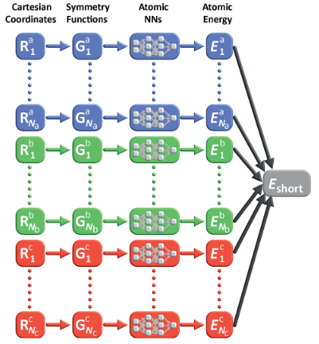

# SymmLearn

## Installation

You can install `SymmLearn` directly from its source repository using Julia's package manager:

```julia
using Pkg
Pkg.add(url="https://github.com/yourusername/SymmLearn.jl")

Alternatively, if you have cloned the repository locally, you can use:

using Pkg
Pkg.develop(path="/path/to/SymmLearn")

After installation, you can load the package with:

using SymmLearn


This project implements a Machine Learning Force Field (MLFF) using Julia and the Flux.jl deep learning framework. The main goal is to predict the total energy of atomic systems based on interatomic distances through a Behler-Parrinello Neural Network approach:

Each neural network corresponds to a specific atom type and predicts its atomic energy from its local environment.
The total energy of the system is obtained by summing the contributions of all atoms.




This architecture is inspired by second-generation neural network potentials, commonly used in materials science and molecular simulations.

In order to understand how to use this library and how to format the input data we suggest to check the "test" folder, where an extensive example can be found togheter with an example dataset.
